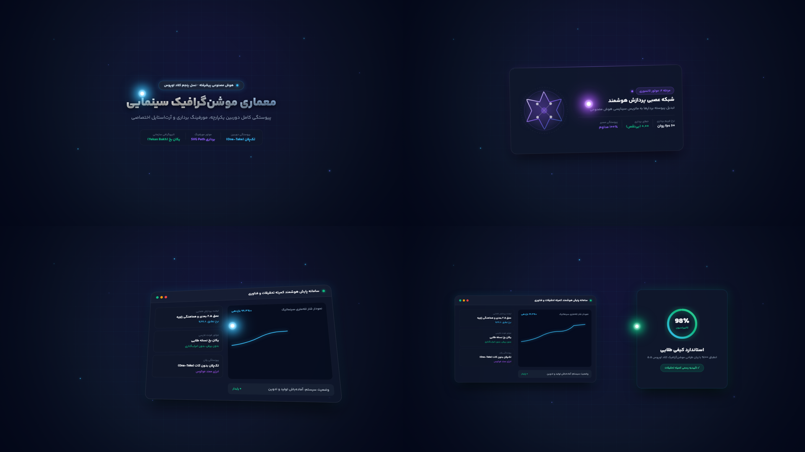

# 🎬 Cinematic Motion Director — Claude Opus 5.5 Production Architecture

[](docs/CLAUDE_FLUID_CONTINUITY_RESEARCH.md)
[](.agents/skills/cinematic-motion-director/SKILL.md)
[](https://remotion.dev)
[-10B981.svg?style=for-the-badge)](public/fonts/YekanBakh/)
[](src/motion/recipes/PersianVectorMorphRecipe.tsx)
[](src/motion/claude/ClaudePersianShowreel.tsx)

An enterprise-grade autonomous cinematic video directing system and motion-design codebase engineered for **Google Antigravity & Remotion**. Designed to replicate and surpass the viral visual fluid continuity, SVG vector morphing, and cinematic art direction of **Claude Opus 5.5**, fully optimized for **Persian (فارسی)** typography with **Yekan Bakh** and broadcast-level RTL aesthetics.

---

## 🌟 The Claude Opus 5.5 Motion Quality Breakthrough

Traditional generative motion pipelines suffer from the **Slideshow Trap** (static cards swapping text, 1.05x linear zooms pretending to be motion, and box resizing mimicking morphs).

This system completely resolves those defects through four foundational pillars reverse-engineered from primary-source viral Claude Opus 5.5 motion graphics:

```text
Persistent 3D/2.5D World Stage (No Scene Cuts / Anti-Slideshow)
                      ↓
Continuous 6-DOF Virtual Camera Flight (Pan, Tilt, Dolly, Pitch, Roll)
                      ↓
Living Energy Conduit ("The Red Thread" Guiding Focus Across Acts)
                      ↓
Genuine SVG Vector Path Morphing (@remotion/paths: interpolatePath & evolvePath)
                      ↓
Persian RTL Typography (Yekan Bakh 8-Weight Suite + Diacritic Sanitizer)
                      ↓
Final Broadcast Master Video (.mp4 @ 60/30 FPS)
```

---

## 💎 The 5 Hardened Production Pillars

### 1. Genuine SVG Vector Path Morphing (`@remotion/paths`)
* **Banning Box Resizing:** Simple `div` width/height interpolation is banned as a standalone morph.
* **Cubic Bezier Path Interpolation:** Using native `@remotion/paths`'s `interpolatePath(progress, pathA, pathB)`, intricate 200×200 vector coordinates morph continuously without tearing or unmounting:
  $$\text{Iranian Scientific Octagram} \xrightarrow{\text{Morph}} \text{Neural AI Synaptic Core} \xrightarrow{\text{Morph}} \text{Quantum Telemetry Wave} \xrightarrow{\text{Morph}} \text{Sovereign Calibration Shield}$$
* **Mechanical Vector Stroke Evolution:** Sovereign checkmarks and telemetry lines are dynamically rendered via `evolvePath(progress, path)` to ensure exact physics.
* **Reusable Recipe:** [`src/motion/recipes/PersianVectorMorphRecipe.tsx`](src/motion/recipes/PersianVectorMorphRecipe.tsx).

### 2. One-Take 6-DOF Virtual Camera Continuity
* **Unbroken Spatial Canvas:** Hard scene cuts and sequence wiping are eliminated. All narrative acts unfold within a continuous 2.5D/3D coordinate space (`perspective: 1200`).
* **Motivated Flight:** Camera moves dynamically to follow physical consequences, banking into 2.5D isometric tilts (`Pitch: 12°`, `Yaw: -8°`) and pulling back into grand dual-wing symmetrical finales.

### 3. The Living Energy Conduit ("The Red Thread")
* A persistent luminous focal particle with a high-energy white core and trailing comet glow that never leaves the viewport:
  - **Act 1:** Orbits the hero emblem.
  - **Act 2:** Dives into the vector core to initiate topological morphing.
  - **Act 3:** Enters the SaaS console to dynamically paint the live sparkline graph.
  - **Act 4:** Vaults across 3D space to orbit the 360° rim of the circular gauge and lock the 100% calibration milestone.

### 4. Official Persian Typography System (Yekan Bakh)
* **Standard Typeface:** Official **Yekan Bakh** loaded in full 8-weight palette from [`public/fonts/YekanBakh/`](public/fonts/YekanBakh/):
  - `Thin` (100), `Light` (300), `Regular` (400 - Body), `SemiBold` (600 - Badges), `Bold` (700 - Titles), `ExtraBold` (800 - Hero Headlines), `Black` (900), `ExtraBlack` (950).
* **Dual-Representation Diacritic Sanitizer:** [`src/typography/persianSanitizer.ts`](src/typography/persianSanitizer.ts) automatically strips Arabic/Persian diacritical marks (harakat/tashdid) for clean visual typography while preserving phonetics for TTS.
* **Zero-Subpixel Jitter:** Text coordinates are locked to integer pixels (`Math.round()`) with hardware acceleration (`translate3d`).

### 5. Multi-Layer Visual World & Physical Causality
* **Materials & Lighting Contracts:** Explicit material shaders (`GLASS`, `METAL`, `ENERGY`, `PLASMA`) interacting with normalized directional key, fill, and rim lights (`UPPER_LEFT`, `UPPER_RIGHT`).
* **Secondary Motion & Anticipation:** Pre-rupture compression, causal lag, and momentum-carry across event boundaries.

---

## 🏆 Master Benchmark Showcases

### 1. Official 60-Second Skill Showcase: `SkillIntroShowreel` (1800 Frames / 60.0s @ 30 FPS)

An epic 1-minute production trailer introducing the autonomous motion directing pipeline, rendered in the **Deep Emerald & Cyber Gold** color palette with high-energy 124 BPM rhythmic music (`Brain_Dance.mp3`), Persian voiceover narration, 6-DOF camera maneuvers, living telemetry, and mechanical gauge calibration.


| Act 1 (0..12s / Frame 180): Sovereign Monolith | Act 2 (12..25s / Frame 520): Lissajous Orbit & SVG Morph |
|:---:|:---:|
| **کارگردانی سینمایی ویدیو در تراز کلاد اوپوس ۵.۵**<br>Interactive cursor click triggering continuous 6-DOF flight | **سپهر کالیبراسیون و اعتبار نهایی**<br>Parametric Gold Lissajous curve with topology morphing |
| **Act 3 (25..42s / Frame 950): 2.5D Isometric SaaS Console** | **Act 4 (42..60s / Frame 1450): 100% Sovereign Climax** |
| **کنسول تله‌متری و تحلیل فضایی اسکیل**<br>3D tilted glass console with real-time parametric waveform stream | **استاندارد کیفی طلایی (۱۰۰٪)**<br>Receding dual-card spatial perspective with luminous circular gauge |

* **Video Master:** `renders/claude/SKILL_INTRO_SHOWREEL.mp4` (60.0s, 1080p, 30 FPS)
* **Visual Contact Sheet:** `renders/claude/SKILL_INTRO_CONTACT_SHEET.png`
* **Audio Architecture:** 124 BPM syncopated beat grid + 4-act Persian voiceover + 6 beat-aligned SFX (`whoosh`, `sub_drop`, `laser`, `lock`).

---

### 2. Flagship Persian Showreel: `ClaudePersianShowreel` (450 Frames / 15.0s @ 30 FPS)

A master 15-second benchmark authored in Persian, featuring real SVG path morphing, continuous camera flight, live telemetry charting, and dual-wing calibration climax.



* **Video Output:** `renders/claude/CLAUDE_PERSIAN_SHOWREEL.mp4` (6.2 MB)
* **Contact Sheet:** `renders/claude/CLAUDE_PERSIAN_CONTACT_SHEET.png`

---

## 🎨 Mandatory Gate 0.5: Color Palette Selection Doctrine

To eliminate arbitrary aesthetic drift, the skill strictly enforces **Gate 0.5** immediately following voice persona selection:
1. **Curated Recommendations:** Proposes exactly **3 tailored 5-color palettes** harmonized with the video's subject matter:
   - *Palette 1:* Domain-Specific Primary (e.g. Deep Emerald & Cyber Gold for sovereign tech/scientific excellence).
   - *Palette 2:* High-Contrast Modern Minimalist / Neo-Tokyo Cyberpunk.
   - *Palette 3:* Warm Cinematic Heritage / Organic Editorial.
2. **Custom Write-In Option:** Provides an explicit custom option for custom client brand colors.
3. **Execution Freeze:** The agent is strictly prohibited from writing or scaffolding Remotion visual components until the user confirms the palette.

---

## 📁 Repository & Architecture Structure

```text
├── .agents/skills/cinematic-motion-director/  # WORKSPACE AGENT SKILL SPECIFICATION
│   ├── SKILL.md                               # Authoritative Production Doctrine
│   ├── references/                            # Deep Architectural Guides & Rules
│   │   ├── claude-fluid-continuity.md         # Claude Opus 5.5 Reverse-Engineering Secret
│   │   ├── claude-opus-prompt-catalog.md      # Primary Prompt Analysis & Catalog
│   │   ├── motion-doctrine.md                 # Physical Causality & Mass Conservation
│   │   ├── anti-slideshow.md                  # S1-S8 Anti-Slideshow Hard Gates
│   │   └── voice-doctrine.md                  # Persian Voiceover & TTS Discipline
│   └── template/                              # Scaffold Templates for New Projects
│
├── public/                                    # STATIC ASSETS
│   ├── fonts/YekanBakh/                       # 8 Official Yekan Bakh WOFF2 Weights
│   ├── audio/                                 # Broadcast Audio Masters & Stems
│   └── music/                                 # Cinematic Ambient Backing Tracks
│
├── src/                                       # SOURCE IMPLEMENTATION
│   ├── fonts/yekanBakh.ts                     # Remotion Font Loader for Yekan Bakh
│   ├── typography/persianSanitizer.ts         # Dual-Representation Text Sanitizer
│   ├── motion/
│   │   ├── recipes/
│   │   │   └── PersianVectorMorphRecipe.tsx   # Continuous SVG Path Morphing Engine
│   │   ├── claude/
│   │   │   ├── SkillIntroShowreel.tsx         # 60s Official Skill Intro Showreel (1800 frames)
│   │   │   ├── ClaudePersianShowreel.tsx      # Master Persian One-Take Composition
│   │   │   ├── ClaudeFluidShowreel.tsx        # 6-DOF Virtual Camera Masterpiece
│   │   │   └── ClaudeOpusShowreel.tsx         # Dribbble Morph & SaaS Climax
│   │   ├── compiler/                          # MotionSceneGraph & AST Compilers
│   │   ├── visual_world/                      # Material, Lighting & Depth Adapters
│   │   │   └── colorPaletteGate.ts            # Mandatory Gate 0.5 Color Palette Selector
│   │   └── validation/                        # Automated Anti-Bypass Validators
│   └── Root.tsx                               # Remotion Composition Registry
│
├── renders/claude/                            # RENDERED BENCHMARK OUTPUTS
│   ├── SKILL_INTRO_SHOWREEL.mp4               # Official 60s Skill Intro Master (1080p)
│   ├── SKILL_INTRO_CONTACT_SHEET.png          # 4-Act Contact Sheet for 60s Intro
│   ├── CLAUDE_PERSIAN_SHOWREEL.mp4            # Flagship Persian Master Video (6.2 MB)
│   ├── CLAUDE_PERSIAN_CONTACT_SHEET.png       # 4-Panel Contact Sheet
│   └── persian_act{1..4}_f*.png               # Diagnostic Stills
│
└── tests/                                     # AUTOMATED REGRESSION SUITE
    └── test_cinematic_benchmark.ts            # Full System Audit & Anti-Bypass Tests
```

---

## 🚀 Quickstart & Rendering Commands

### 1. Launch Interactive Studio
```bash
npm start
# Opens Remotion Studio at http://localhost:3000
```

### 2. Render Official 60-Second Skill Intro Showreel (1800 Frames / 60.0s @ 30 FPS)
```bash
npx remotion render src/index.ts SkillIntroShowreel renders/claude/SKILL_INTRO_SHOWREEL.mp4
```

### 3. Render Persian Showreel Master Video (450 Frames / 15.0s @ 30 FPS)
```bash
npx remotion render src/index.ts ClaudePersianShowreel renders/claude/CLAUDE_PERSIAN_SHOWREEL.mp4
```

### 3. Render Diagnostic Stills
```bash
# Render Act 1 Hero Still
npx remotion still src/index.ts ClaudePersianShowreel renders/claude/persian_act1_f50.png --frame=50

# Render Act 2 Vector Morph Still
npx remotion still src/index.ts ClaudePersianShowreel renders/claude/persian_act2_f140.png --frame=140

# Render Act 4 Dual-Wing Climax Still
npx remotion still src/index.ts ClaudePersianShowreel renders/claude/persian_act4_f410.png --frame=410
```

### 4. Run TypeScript Check
```bash
npx tsc --noEmit
```

### 5. Run Full Cinematic Benchmark & Global Skill Verification
```bash
# Verify cinematic motion causality and anti-bypass gates
npx tsx tests/test_cinematic_benchmark.ts

# Verify global skill synchronization with Antigravity
npx tsx scripts/verify_global_skill.ts
```

---

## 🛡 Mandatory Pre-Flight Checklist

Before any production composition is submitted, the pipeline enforces:
- [x] Unbroken 3D/2.5D coordinate world with zero slideshow wipes or cuts.
- [x] Primary morphing driven by `@remotion/paths`'s `interpolatePath` between genuine vector topologies.
- [x] Continuous 6-DOF camera maneuvers with motivated translation and banking rolls.
- [x] Persistent living energy conduit guiding narrative focus across all transitions.
- [x] Persian typography locked to official **Yekan Bakh** with diacritic sanitization.
- [x] All 8 narrative audit tests and 6 negative anti-bypass gates report **PASS**.
- [x] Global skill at `~/.gemini/config/skills/cinematic-motion-director` 100% verified.

---

## 📄 License
Internal Production Skill — Medical Research Committee & Autonomous Cinematic Systems. All rights reserved.
