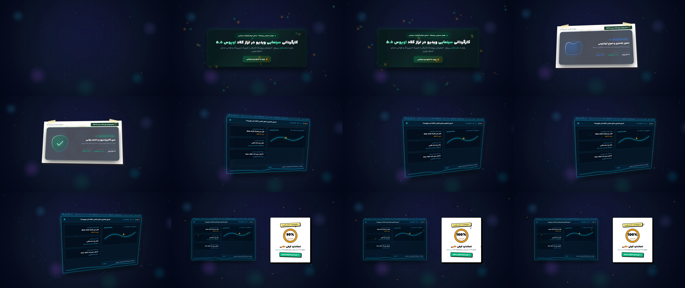

# 🎬 اسکیل موشن گرافیک برای آنتی گرویتی | Motion Graphics Skill for Antigravity

[](docs/CLAUDE_FLUID_CONTINUITY_RESEARCH.md)
[](.agents/skills/cinematic-motion-director/SKILL.md)
[](https://remotion.dev)
[-10B981.svg?style=for-the-badge)](public/fonts/YekanBakh/)
[](src/motion/recipes/PersianVectorMorphRecipe.tsx)
[](src/motion/claude/SkillIntroShowreel.tsx)

[English](#-english) • [فارسی](#-اسکیل-موشن-گرافیک-برای-آنتی-گرویتی-فارسی)

---

## 🎥 Master Production Video Showcase / ویدیوی مستر خروجی

### 60-Second Master Video Trailer (`SKILL_INTRO_SHOWREEL.mp4`)

> **[▶ Download & Watch Master 1080p Video](renders/claude/SKILL_INTRO_SHOWREEL.mp4)**  
> *60.0s (1800 Frames @ 30 FPS) • 1080p Broadcast • 124 BPM Future Beats • Two-Stage Persian Voiceover*



| پرده اول / Act 1 (0..12s / f220) | پرده دوم / Act 2 (12..26s / f480) |
|:---:|:---:|
| **ورود شیشه‌ای و کلیک ارگانیک**<br>Glassmorphic Monolith with Viscous Liquid Squash Button & Interactive Cursor | **استاپ‌موشن کلاژ و مورفینگ برداری**<br>Stop-Motion Paper Cutout (12 FPS) with 4-Stage Stepper & Topological Vector Morph |
| **پرده سوم / Act 3 (26..42s / f950)** | **پرده چهارم / Act 4 (42..60s / f1450)** |
| **کنسول تله‌متری و تحلیل فضایی (بلوپرینت)**<br>Intimate 2.5D CAD Blueprint Console with Kinetic Bar Charts & Live Waveform | **پاویون متقارن و استاندارد طلایی**<br>Symmetrically Docked Dual-Pavilion with Luminous 100% Calibration Gauge |

---

# 🇬🇧 English

## 🌟 Overview

**Cinematic Motion Director** is an autonomous cinematic video directing pipeline and production-grade motion design system built on **Remotion, React 19, and Google Antigravity**.

Designed to replicate and surpass the viral visual fluid continuity, SVG topological morphing, and physical camera choreography of **Claude Opus 5.5**, this architecture features full native support for **Persian (فارسی)** typography with the **Yekan Bakh** suite and zero-subpixel-jitter RTL rendering.

### 🚫 The Anti-Slideshow Mandate
Traditional AI-generated video tools trap users in the **Slideshow Trap**: static cards swapping text, 1.05x linear scale zooms mimicking movement, and box width resizing masquerading as morphs.

This pipeline eliminates those flaws through an **unbroken spatial world stage**, a **continuous 6-DOF virtual camera**, and **genuine vector topology morphing**.

---

## 💎 The 6 Core Architectural Pillars

### 1. Genuine SVG Vector Path Morphing (`@remotion/paths`)
- **No Div Resizing:** Box width/height interpolation is banned as a standalone morph.
- **Topological Bezier Interpolation:** Using native `interpolatePath(t, pathA, pathB)`, multi-point vector coordinates smoothly morph across parametric states without unmounting or visual tearing:
  $$\text{Octagram Glyph} \xrightarrow{\text{Morph}} \text{Neural AI Synapse} \xrightarrow{\text{Morph}} \text{Quantum Wave} \xrightarrow{\text{Morph}} \text{Calibration Shield}$$
- **Mechanical Stroke Evolution:** Telemetry circuits and checkmarks render dynamically via `evolvePath(progress, path)`.

### 2. Continuous 6-DOF One-Take Virtual Camera
- **Unbroken Spatial Canvas:** Sequences never fade to black or wipe. All acts reside in a persistent 3D coordinate space (`perspective: 1200`).
- **Motivated Flight Grammar:** The camera translates through $X$, $Y$, and $Z$, tilting into 2.5D isometric angles (`Pitch: -1.8°`, `Yaw: 2.2°`) with kinetic banking rolls (`Roll: ±3.5°`) and velocity-driven motion skew during speed ramps.

### 3. Newtonian Vector Attractor Swarm Physics
- **Deterministic Gravitational Vortex:** An inverse-distance particle orbital engine orbiting active vector attractor cores across all narrative acts.
- **Airy & Delicate Balance:** Low-density particles (18–20 particles per act) with soft glows (0.18 opacity), harmonic beat breathing, and radial click shockwave dispersion.

### 4. Official Persian Typography System (Yekan Bakh)
- **8 Distinct Weights:** Loaded from WOFF2 (`Thin 100`, `Light 300`, `Regular 400`, `SemiBold 600`, `Bold 700`, `ExtraBold 800`, `Black 900`, `ExtraBlack 950`).
- **Dual-Representation Sanitizer:** Automatically removes diacritical marks (harakat/tashdid) for clean visual layout while preserving phonetic cues for TTS synthesis.
- **Zero-Subpixel Jitter:** Text coordinates are rounded to whole integer pixels with hardware acceleration (`translate3d`).

### 5. Studio Audio & Beat-Grid Synchronization (124 BPM)
- **Quantized Beat Grid:** Keyframe events snap mathematically to musical subdivisions (whole beat, 8th note, 16th note).
- **Softened Audio-Reactive Heartbeat:** Subtle kick-drum pulse ($+0.2\%$ to $+0.45\%$ scale) provides organic breathing without frame vibration.
- **Dynamic Sidechain Ducking:** BGM ducks cleanly from 32% to 16% volume during voiceover segments.

### 6. Multi-Style Visual World Evolution
- **Gate 0.6 Multi-Style Paradigm:** Supports act-by-act transformation across:
  - `MODERN_GLASSMORPHIC`: Frosted glass (`backdropFilter: blur(24px)`), dynamic specular highlights, and spring physics.
  - `STOP_MOTION_PAPER`: Tactile paper cutout collage, 12 FPS stepped motion, and kraft tape accents.
  - `TECHNICAL_BLUEPRINT`: Engineering CAD drafting grid, cyan isometric calipers, and monospace telemetry metrics.
  - `NEO_BRUTALIST`: High-voltage poster punch, thick black borders (`4px solid #000`), hard offset drop shadows (`14px 14px 0px #000`), and acid yellow accents.

---

## 📁 Repository Structure

```text
├── .agents/skills/cinematic-motion-director/  # WORKSPACE AGENT SKILL
│   ├── SKILL.md                               # Authoritative Production Doctrine
│   └── references/                            # Motion Doctrine & Anti-Slideshow Rules
│
├── public/                                    # STATIC ASSETS
│   ├── fonts/YekanBakh/                       # 8 Official Yekan Bakh WOFF2 Weights
│   ├── audio/                                 # Synthesized Speech Audio Segments
│   └── music/                                 # 124 BPM Studio Backing Tracks
│
├── src/                                       # SOURCE CODE
│   ├── fonts/yekanBakh.ts                     # Remotion Font Loader
│   ├── typography/persianSanitizer.ts         # Dual-Representation Text Sanitizer
│   ├── motion/
│   │   ├── recipes/
│   │   │   └── PersianVectorMorphRecipe.tsx   # SVG Path Morphing Recipe
│   │   ├── library/
│   │   │   ├── NewtonianAttractorSwarm.tsx    # Gravitational Particle Swarm Engine
│   │   │   ├── KineticDataViz.tsx             # Studio Bar Charts & Live Telemetry
│   │   │   ├── DynamicFresnelSweep.tsx        # Specular Angle-Driven Light Sweep
│   │   │   └── OrganicLiquidGooey.tsx         # Viscous Button Squash & Droplets
│   │   ├── claude/
│   │   │   ├── SkillIntroShowreel.tsx         # 60s Master Showreel (1800 Frames)
│   │   │   └── ClaudePersianShowreel.tsx      # 15s Persian Showcase
│   │   └── audio/
│   │       └── SemanticMusicDirector.ts       # Beat Grid & Audio Envelope
│   └── Root.tsx                               # Remotion Composition Registry
│
├── renders/claude/                            # RENDER OUTPUTS
│   ├── SKILL_INTRO_SHOWREEL.mp4               # 60s 1080p Master Video
│   └── SKILL_INTRO_CONTACT_SHEET.png          # 4-Act Contact Sheet
│
└── tests/                                     # AUDIT & TEST SUITE
    └── test_zero_to_video.ts                  # Automated Regression Tests
```

---

## 🚀 Quickstart & Commands

```bash
# 1. Install dependencies
npm install

# 2. Launch interactive Remotion Studio
npm start

# 3. Render 60-Second Master Video
npx remotion render SkillIntroShowreel renders/claude/SKILL_INTRO_SHOWREEL.mp4 --gl=angle

# 4. Generate Key Diagnostic Still
npx remotion still SkillIntroShowreel out/debug_f870.png --frame=870 --gl=angle

# 5. Run TypeScript Check
npx tsc --noEmit
```

---

# 🇮🇷 اسکیل موشن گرافیک برای آنتی گرویتی (فارسی)

## 🌟 معرفی پروژه

**اسکیل موشن‌گرافیک برای آنتی‌گرویتی (Motion Graphics Skill for Antigravity)** یک سیستم پیشرفته و خودکار برای کارگردانی و تولید ویدیوهای موشن‌گرافیک سینمایی است که بر پایه فریم‌ورک **Remotion** و هوش مصنوعی **Google Antigravity** توسعه یافته است.

این سامانه با هدف بازتولید و ارتقای کیفیت موشن‌گرافیک‌های مشهور **Claude Opus 5.5** طراحی شده است تا پویایی بصری فوق‌العاده، مورفینگ پیوسته برداری، و پرواز پیوسته دوربین سه‌بعدی را با پشتیبانی کامل از **تایپوگرافی اصیل فارسی (یکان بخ)** و استانداردهای راست‌به‌چپ (RTL) ارائه دهد.

### 🚫 رهایی از تله اسلایدشو (Anti-Slideshow)
در اکثر ابزارهای تولید ویدیوی هوش مصنوعی، نتیجه نهایی به یک «اسلایدشو متحرک» تبدیل می‌شود که در آن کادرها صرفاً محو شده یا جایگزین می‌شوند. 

این سیستم این مشکل را از طریق **صحنه فضایی یکپارچه بدون برش (One-Take)**، **حرکت پیوسته دوربین با ۶ درجه آزادی**، و **مورفینگ واقعی مسیرهای برداری SVG** به طور کامل ریشه‌کن کرده است.

---

## 💎 ارکان شش‌گانه معماری پروژه

### ۱. مورفینگ پیوسته مسیرهای برداری (`@remotion/paths`)
- **ممنوعیت تغییر اندازه جعبه:** تغییر سایز ساده `div` هرگز به عنوان مورف پذیرفته نمی‌شود.
- **مورفینگ بزیه ریاضی:** با استفاده از کتابخانه `@remotion/paths` و تابع `interpolatePath`، بردارها در طول زمان با تقارن ریاضی بدون خروج از کادر یا گسستگی به یکدیگر تبدیل می‌شوند:
  $$\text{نشان ستاره علمی} \xrightarrow{\text{مورف}} \text{شبکه سیناپسی هوش مصنوعی} \xrightarrow{\text{مورف}} \text{امواج تله‌متری} \xrightarrow{\text{مورف}} \text{سپر کالیبراسیون}$$

### ۲. پرواز پیوسته دوربین تک‌پلان با ۶ درجه آزادی (6-DOF)
- **جهان فضایی نامحدود:** حذف کامل کات یا ترنزیشن‌های محوشونده؛ تمام پرده‌ها در یک فضای مختصات سه‌بعدی مداوم (`perspective: 1200`) مستقر هستند.
- **حرکت سینمایی هدفمند:** چرخش‌های نرم دوربین با شیب و زاویه ایزومتریک ۲.۵ بعدی (`Pitch: -1.8°`, `Yaw: 2.2°`)، چرخش بنکینگ در حین جابجایی (`Roll: ±3.5°`)، و فیلتر تاری و اسکیو سرعت در تغییر پرده‌ها.

### ۳. فیزیک ذرات جاذبه‌ای نیوتنی (Newtonian Vector Attractor)
- **گرداب مداری گرانشی:** محاسبه آنی جاذبه ذرات بر اساس فاصله معکوس حول هسته‌های برداری فعال.
- **توزیع ملایم و چشم‌نواز:** کاهش تراکم به ۱۸ تا ۲۰ ذره در هر پرده با درخشش ملایم (شفافیت ۰.۱۸)، پالس تنفسی هماهنگ با بیت موسیقی، و دافعه انفجاری در هنگام کلیک نشانگر ماوس.

### ۴. سامانه استاندارد تایپوگرافی فارسی (یکان بخ)
- **۸ وزن رسمی یکان بخ:** لود کامل فونت‌ها از فرمت استاندارد WOFF2 (`Thin`, `Light`, `Regular`, `SemiBold`, `Bold`, `ExtraBold`, `Black`, `ExtraBlack`).
- **پالایشگر هوشمند دونمایه‌ای:** حذف اعراب و نشانه‌های نامطلوب در لایه بصری ضمن حفظ خوانش صحیح فونتیک در گویندگی صوتی.
- **حذف پرش ساب‌پیکسلی:** قفل شدن مختصات متون روی پیکسل‌های صحیح (`Math.round`) همراه با شتاب‌دهی سخت‌افزاری پردازنده گرافیکی.

### ۵. تنظیم استودیویی صدا و ضرب‌آهنگ (124 BPM)
- **شبکه ضرب‌آهنگ کوانتایز شده:** تراز شدن تمام رویدادها، کلیک‌ها و ورود المان‌ها با ضرب‌های دقیق موسیقی (ضرب کامل، چنگ و دولاچنگ).
- **پالس نرم و طبیعی:** کاهش ۷۰ درصدی دامنه لرزش کادرها به پالس ظریف (+۰.۲٪ تا +۰.۴۵٪) برای ایجاد تنفس ارگانیک بدون لرزش شدید کادرها.
- **داکینگ خودکار موسیقی:** کاهش خودکار صدای پس‌زمینه از ۳۲٪ به ۱۶٪ در زمان پخش صدای گوینده.

### ۶. تکامل چندسبکی پرده‌ها (Multi-Style Evolution)
- **سبک‌های بصری پیاده‌سازی شده:**
  - **گلاسمورفیسم مدرن:** شیشه مات (`backdropFilter: blur(24px)`)، انعکاس متحرک نور فرسنل و فیزیک فنری.
  - **استاپ‌موشن کاغذ:** بافت فیبر مقوا، پرش ریتمیک ۱۲ فریم بر ثانیه و چسب کرافت فیزیکی.
  - **بلوپرینت فنی:** خط‌کش‌های میلی‌متری CAD، خطوط شبکه‌ای فیروزه‌ای و پایش تله‌متری مهندسی.
  - **نئوبروتالیسم:** کادرهای ضخیم مشکی (`4px solid #000`)، سایه‌های سخت زاویه‌دار و نشان کالیبراسیون ۱۰۰٪ طلایی.

---

## 🚀 راهنمای اجرا و رندرینگ

```bash
# ۱. نصب پکیج‌ها
npm install

# ۲. اجرای محیط تعاملی Remotion Studio
npm start

# ۳. رندر ویدیوی مستر ۶۰ ثانیه‌ای
npx remotion render SkillIntroShowreel renders/claude/SKILL_INTRO_SHOWREEL.mp4 --gl=angle

# ۴. رندر تک‌فریم تشخیصی
npx remotion still SkillIntroShowreel out/debug_f870.png --frame=870 --gl=angle

# ۵. بررسی کامل انواع با TypeScript
npx tsc --noEmit
```

---

## 📄 License / مجوز
MIT License — Autonomous AI Cinematic Motion Systems & Remotion Studio Architecture.
