# V24 DIRECTOR SHOT PLAN — ADAPTIVE CHOREOGRAPHY & MOTION BUDGET

**Project:** Persian Editorial Motion Graphics — V24 Narrative Synthesis  
**Duration:** 36.0 Seconds (1,080 Frames @ 30 FPS)  
**Author:** Adaptive Director & Choreographer Layer  
**Architectural Baseline:** V23 Benchmark Laboratory Synthesized  
**Date:** 2026-10-06  

---

## EXECUTIVE SUMMARY & EDITORIAL VISION

V23 proved that the engine possesses the raw capabilities for true geometric morphing, kinetic typography, physical mass translation, ribbon tunnels, camera apertures, persistent motifs, and deliberate silence. 

**V24 is the discipline of restraint.**

A high-end motion-graphics piece does not flaunt all available tricks simultaneously. It translates an intellectual progression into visual causality:

$$\text{IDEA} \longrightarrow \text{VISUAL METAPHOR} \longrightarrow \text{MOTION VERB} \longrightarrow \text{CHOREOGRAPHY} \longrightarrow \text{RHYTHMIC CONTRAST} \longrightarrow \text{TRANSITION} \longrightarrow \text{NEXT IDEA}$$

---

## 1. THE V24 ENERGY CURVE

The sequence is governed by an explicit non-uniform energy curve designed to prevent viewer fatigue and establish dramatic contrast between explosive velocity and frozen contemplative stillness:

```
Energy Level (1 - 5)
 5 |                             [BEAT 04: PEAK]
 4 |                                               [BEAT 06: SLAM] [BEAT 07: PUNCH]
 3 |                   [BEAT 03: BUILD]
 2 | [BEAT 01: CALM] [BEAT 02: SEED]                                                 [BEAT 08: SETTLE]
 1 |                                                 [BEAT 05: SILENCE]
---+-------------------------------------------------------------------------------------------------
F:   0               120               240         390             540             660             810             960            1080
```

### Energy Value Sequence:
`[2, 2, 3, 5, 1, 4, 4, 2]`

- **Contrast Rule:** The highest energy moment (Beat 04, Level 5) is immediately followed by the lowest energy moment (Beat 05, Level 1: a 2.5-second unbroken hold of absolute frozen silence).

---

## 2. MOTION BUDGET AUDIT MATRIX

The Director enforces strict mathematical guardrails to eliminate cliché repetitions and visual clutter:

| Metric | Target Rule | Budgeted Value | Audit Status |
|---|---|---|:---:|
| **Total Frames** | 900 – 1200 frames | **1,080 frames (36.00s)** | **PASS** |
| **Beat Count** | 6 – 8 beats | **8 beats** | **PASS** |
| **Consecutive Identical Hero Transform** | Prohibited ($0$) | **0** | **PASS** |
| **Consecutive Identical Transitions** | Prohibited unless justified | **0** | **PASS** |
| **Camera Moving Frames** | $\le 50\%$ (Restraint Rule) | **41.7% (450 / 1080 frames)** | **PASS** |
| **Static Camera Frames** | $\ge 50\%$ | **58.3% (630 / 1080 frames)** | **PASS** |
| **Deliberate Silence Holds** | At least one beat $\ge 45\text{f}$ @ Energy 1 | **Beat 05: 75 frames (2.5s)** | **PASS** |
| **Transition Diversity** | $\ge 5$ distinct classes | **6 distinct classes** | **PASS** |
| **Motion Density Score** | $> 8.0 / 10$ | **9.5 / 10** | **PASS** |

---

## 3. OBJECT IDENTITY GRAPH

Perceptual identity is maintained across topological transformations through continuous physical carriers, while allowing entities to terminate when their narrative function is fulfilled:

```mermaid
graph LR
    subgraph Beat01
        B1["ID_DATUM<br/>Horizontal Line"]
    end
    subgraph Beat02
        B2["ID_NUCLEUS<br/>Golden Kinetic Seed"]
    end
    subgraph Beat03
        B3["ID_DATA_PILLARS<br/>4 Monolithic Bars"]
    end
    subgraph Beat04
        B4["ID_ORBIT_RING<br/>Luminous Orbit Ring"]
    end
    subgraph Beat05
        B5["ID_GEOMETRIC_IRIS<br/>Hairline Static Iris"]
    end
    subgraph Beat06
        B6["ID_KINETIC_WORD<br/>«شتاب» & Compass Star"]
    end
    subgraph Beat07
        B7["ID_PORTAL_RING<br/>Aperture Portal"]
    end
    subgraph Beat08
        B8["ID_SOVEREIGN_CREST<br/>Sovereign Star & Plinth"]
    end

    B1 -->|TRANSFORM: Compress| B2
    B2 -->|TRANSFORM: Split| B3
    B3 -->|TRANSFORM: Fuse & Coil| B4
    B4 -->|HOLD: Freeze & Dilate| B5
    B5 -->|TRANSFORM: Fracture & Assemble| B6
    B6 -->|CAMERA: Plunge Through| B7
    B7 -->|TERMINATE & REFRAME| B8
```



---

## 4. BEAT-BY-BEAT SPECIFICATIONS

### BEAT 01: GENESIS / THE HORIZONTAL DATUM
- **Frames:** $0 - 120$ ($4.00$s)
- **Energy Level:** $2$ (CALM)
- **Semantic Purpose:** The origin of analytical inquiry out of pure dark potential.
- **Visual Metaphor:** A singular golden coordinate datum line extrudes horizontally across the spatial vacuum.
- **Primary Subject:** Horizontal Coordinate Datum Line (`ID_DATUM`).
- **Secondary Subjects:** Faint sub-grid coordinate tick points.
- **Motion Verb:** Quiet center-out trace with extended silence hold.
- **Transformation Type:** `EXPANSION`
- **Camera Behavior:** `STATIC` (100% stillness; camera movement strictly prohibited).
- **Hold Duration:** $50$ frames ($1.67$s of pure stillness).
- **Transition Out:** `TRANSFORM` $\to$ line compresses toward center.
- **Continuity Target:** `center_datum_point`
- **Typography Role:** `STILL_ANCHOR` — Persian word «نقطه آغاز» (The Origin Point) anchored in stillness.
- **Negative Space Budget:** $82\%$ empty canvas.
- **Composition Alignment:** `BOTTOM_WEIGHTED`

---

### BEAT 02: NUCLEUS ACCELERATION / DIRECTIONAL INTENT
- **Frames:** $120 - 240$ ($4.00$s)
- **Energy Level:** $2$ (EMERGENCE)
- **Semantic Purpose:** Crystallization of intention into an active directional kinetic vector.
- **Visual Metaphor:** Datum line collapses into an energetic golden nucleus dot, gathers elastic anticipation, and launches rightward.
- **Primary Subject:** Golden Nucleus Dot (`ID_NUCLEUS`).
- **Secondary Subjects:** Directional velocity trail and momentum ripples.
- **Motion Verb:** Compression, horizontal slingshot launch, and squash/stretch ($1.35\times$ stretch, $0.74\times$ squash).
- **Transformation Type:** `DEFORM`
- **Camera Behavior:** `STATIC` (The object moves; the camera holds firm).
- **Hold Duration:** $35$ frames.
- **Transition Out:** `REFRAME` $\to$ momentum vector anchors the left margin.
- **Continuity Target:** `nucleus_momentum_vector`
- **Typography Role:** `DYNAMIC_VERB` — Persian word «تمرکز» (Focus) entering on kinetic trail.
- **Negative Space Budget:** $76\%$ empty canvas.
- **Composition Alignment:** `LEFT_WEIGHTED`

---

### BEAT 03: DATA PILLARS BUILD / ANALYTICAL WEIGHT
- **Frames:** $240 - 390$ ($5.00$s)
- **Energy Level:** $3$ (BUILD / TENSION)
- **Semantic Purpose:** Structured accumulation of empirical evidence creating architectural tension and analytical authority.
- **Visual Metaphor:** The horizontal trajectory fractures vertically into $4$ monolithic architectural data pillars ascending with staggered spring tension.
- **Primary Subject:** $4$ Analytical Monolith Pillars (`ID_DATA_PILLARS`).
- **Secondary Subjects:** Measurement tick lines, vertex connection baseline.
- **Motion Verb:** Staggered vertical spring eruption with tension anticipation.
- **Transformation Type:** `SPLIT`
- **Camera Behavior:** `PUSH` (Slow, dignified $1.00 \to 1.04$ creep to convey structural mass).
- **Hold Duration:** $30$ frames.
- **Transition Out:** `COLLAPSE` $\to$ pillars compress into $4$ peak vertex nodes.
- **Continuity Target:** `pillar_top_vertices`
- **Typography Role:** `SUBORDINATE_LABEL` — Persian label «پایه‌های تجربی» (Empirical Foundations).
- **Negative Space Budget:** $62\%$ empty canvas.
- **Composition Alignment:** `CENTER`

---

### BEAT 04: KINETIC PEAK / AERODYNAMIC FLIGHT & COIL
- **Frames:** $390 - 540$ ($5.00$s)
- **Energy Level:** $5$ (PEAK IMPACT)
- **Semantic Purpose:** Empirical mass synthesizes into an aerodynamic velocity curve and coils into a luminous celestial ring.
- **Visual Metaphor:** Peak vertex nodes connect into a dynamic Bézier spline, take flight, and loop into a high-speed orbital vortex.
- **Primary Subject:** Aerodynamic Flight Curve $\to$ Luminous Orbit Ring (`ID_ORBIT_RING`).
- **Secondary Subjects:** Vertex connective splines, centrifugal wave trails.
- **Motion Verb:** Rapid topological coiling, centrifugal expansion, and rotational kinetic snap.
- **Transformation Type:** `TOPOLOGY_MORPH` (Continuous vertex deformation without opacity fades).
- **Camera Behavior:** `PUSH` (Motivated acceleration $1.04 \to 1.12$ tracking vortex emergence).
- **Hold Duration:** $15$ frames.
- **Transition Out:** `HOLD` $\to$ sudden snap freezing.
- **Continuity Target:** `celestial_ring_perimeter`
- **Typography Role:** `HERO_GEOMETRIC` — Persian word «جهش» (Quantum Leap).
- **Negative Space Budget:** $52\%$ empty canvas.
- **Composition Alignment:** `CENTER`

---

### BEAT 05: DEEP FROZEN SILENCE / CONTEMPLATIVE CONTRAST
- **Frames:** $540 - 660$ ($4.00$s)
- **Energy Level:** $1$ (ABSOLUTE SILENCE)
- **Semantic Purpose:** Immediate acoustic and motion vacuum following violent kinetic peak; creates emotional depth.
- **Visual Metaphor:** The violent orbital vortex instantly snaps into an ultra-thin hairline geometric iris in deep frozen stillness.
- **Primary Subject:** Hairline Geometric Iris (`ID_GEOMETRIC_IRIS`).
- **Secondary Subjects:** Faint central laser point ($2$px).
- **Motion Verb:** Absolute frozen hold; zero drift, zero particles, zero vibrations.
- **Transformation Type:** `NONE` (Deliberate intentional stillness).
- **Camera Behavior:** `STATIC` (100% frozen camera lock).
- **Hold Duration:** **75 frames (2.50 seconds of unbroken deliberate silence).**
- **Transition Out:** `EXPANSION` $\to$ central point pulses outward.
- **Continuity Target:** `hairline_iris_core`
- **Typography Role:** `STILL_ANCHOR` — Persian word «سکوت ژرف» (Deep Silence).
- **Negative Space Budget:** $85\%$ empty canvas.
- **Composition Alignment:** `EDGE_OFF_AXIS`

---

### BEAT 06: KINETIC TYPOGRAPHY / LETTERFORM AS GEOMETRY
- **Frames:** $660 - 810$ ($5.00$s)
- **Energy Level:** $4$ (KINETIC SLAM & DISSECTION)
- **Semantic Purpose:** Linguistic intellect acts as physical matter; the word impacts, fractures into pen vectors, and reassembles as a geometric emblem.
- **Visual Metaphor:** Persian word «شتاب» (Velocity) slams down onto the datum line, fractures into $8$ vector pen fragments, and reassembles into an intricate Compass Star emblem.
- **Primary Subject:** Word «شتاب» $\to$ Compass Star Emblem (`ID_KINETIC_WORD`).
- **Secondary Subjects:** Baseline datum beam, $8$ radial pen vectors.
- **Motion Verb:** Heavy slam with squash/stretch, stroke fracture, and rotational geometric convergence.
- **Transformation Type:** `LETTERFORM_DISSECT`
- **Camera Behavior:** `STATIC` (Camera holds still; typographic mass commands attention).
- **Hold Duration:** $30$ frames.
- **Transition Out:** `CAMERA` $\to$ camera aligns to compass star center.
- **Continuity Target:** `compass_star_center`
- **Typography Role:** `HERO_GEOMETRIC` — The word «شتاب» physically becomes the geometry.
- **Negative Space Budget:** $65\%$ empty canvas.
- **Composition Alignment:** `LEFT_WEIGHTED`

---

### BEAT 07: CAMERA APERTURE PUNCH-THROUGH
- **Frames:** $810 - 960$ ($5.00$s)
- **Energy Level:** $4$ (DIMENSIONAL TRAVERSAL)
- **Semantic Purpose:** Crossing the threshold of discovery; the viewer punches through the geometric aperture into the sovereign realm.
- **Visual Metaphor:** Compass Star emblem dilates into an architectural ring portal; camera plunges directly through its open center with multi-plane depth parallax.
- **Primary Subject:** Architectural Aperture Portal (`ID_PORTAL_RING`).
- **Secondary Subjects:** Receding multi-plane depth rings, directional axial light rays.
- **Motion Verb:** Camera punch-through aperture with exponential scale plunge ($1.00 \to 2.60$).
- **Transformation Type:** `CAMERA_PASS`
- **Camera Behavior:** `THROUGH` (Motivated dimensional traversal).
- **Hold Duration:** $20$ frames.
- **Transition Out:** `REFRAME` $\to$ exit from portal reveals sovereign realm.
- **Continuity Target:** `portal_through_horizon`
- **Typography Role:** `SILENT_NONE` (Camera traversal provides complete narrative voice; captions prohibited).
- **Negative Space Budget:** $58\% \longrightarrow 80\%$ (Expanding into deep space).
- **Composition Alignment:** `CENTER`

---

### BEAT 08: SOVEREIGN RESOLUTION / ENDURING DIGNITY
- **Frames:** $960 - 1080$ ($4.00$s)
- **Energy Level:** $2$ (RESOLVED MAJESTY)
- **Semantic Purpose:** Permanent institutional crystallization; enduring dignity, unshakeable truth, and timeless harmony.
- **Visual Metaphor:** Golden sovereign emblem settles upon an architectural plinth and unshakeable horizon line; settles with subpixel settle-lock.
- **Primary Subject:** Sovereign 8-Pointed Star Crest & Plinth Base (`ID_SOVEREIGN_CREST`).
- **Secondary Subjects:** Polished architectural plinth, fine hairline sub-datum.
- **Motion Verb:** Gentle settle-lock and breathing hold; zero subpixel jitter.
- **Transformation Type:** `SETTLE`
- **Camera Behavior:** `STATIC` (Final authoritative lock).
- **Hold Duration:** **60 frames (2.00 seconds of unshakeable final holding lock).**
- **Transition Out:** `HOLD`
- **Continuity Target:** `sovereign_crest_center`
- **Typography Role:** `STILL_ANCHOR` — Persian title «دانش ماندگار» (Enduring Wisdom).
- **Negative Space Budget:** $74\%$ empty canvas.
- **Composition Alignment:** `CENTER`

---

## 5. POSE LADDER TIMING IMPLEMENTATION

Transitions within each beat bypass standard linear or ease-in-out interpolation, following the 7-pose mechanical ladder:

$$\text{REST} \xrightarrow{\text{Anticipation (-6\%)}} \text{ANTICIPATION} \xrightarrow{\text{High Velocity}} \text{ACTION} \xrightarrow{\text{Over-extension}} \text{PEAK} \xrightarrow{\text{Elastic Rebound}} \text{OVERSHOOT} \xrightarrow{\text{Decay Dampening}} \text{DECAY} \xrightarrow{\text{Settle-Lock}} \text{SETTLE}$$

- **Anticipation Ratio:** $15\%$ of movement window.
- **Overshoot Magnitude:** $+10\%$ beyond resting datum.
- **Settle-Lock Invariant:** Final $25\%$ of each movement phase snaps to integer subpixel rounding to eliminate residual micro-jitter.

---

## 6. PRE-PRODUCTION SIGN-OFF

The Director Shot Plan satisfies all Phase 1–10 constraints:
1. Every visual beat has an authored intellectual purpose.
2. The motion budget audit passes with $0$ violations.
3. Camera movement is strictly restrained ($58.3\%$ static camera).
4. Deliberate silence is guaranteed with a $2.5$s stillness hold in Beat 05.
5. Typographic verbs and geometric actors operate within Persian calligraphy rules without broken ligatures.

**Production TSX implementation is authorized.**
