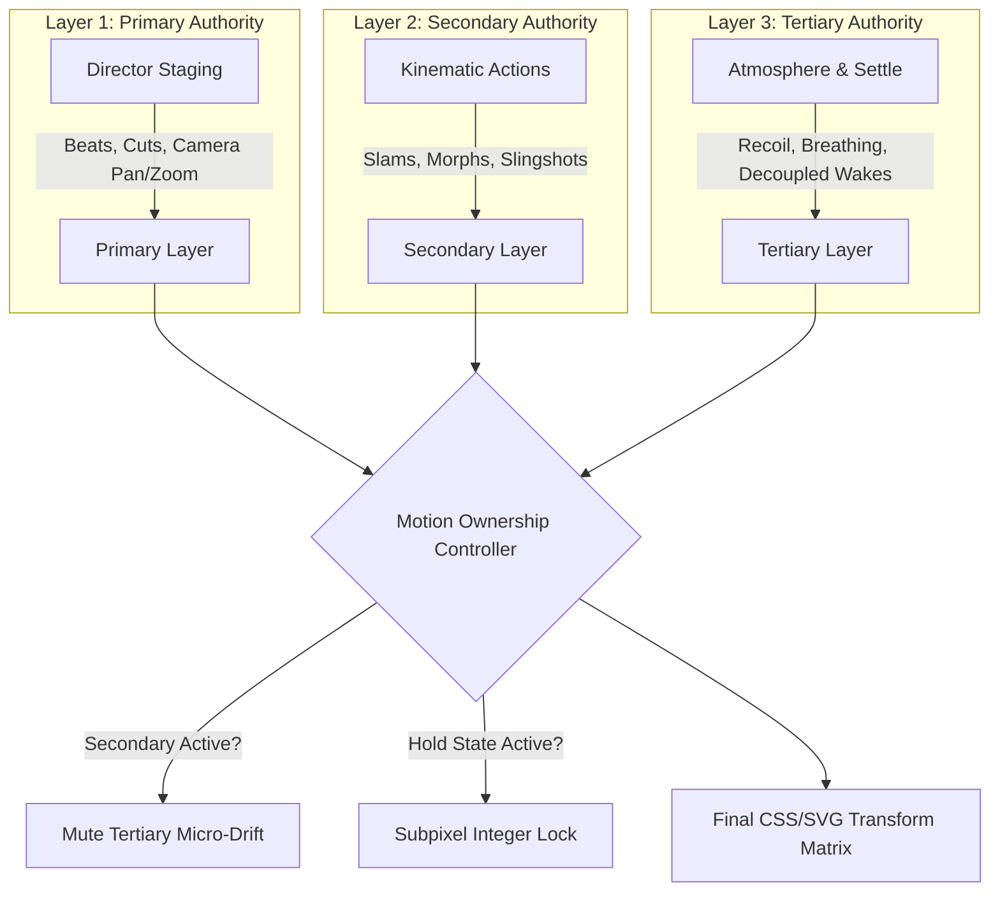

# V25.5 — Motion Ownership Report

## 1. The Core Law of Motion Ownership
> **"At any single frame, an animated transform property must be owned by exactly one authoritative motion source."**

Before V25.5, multiple subsystems attempted to influence the same visual attributes simultaneously:
- **Primary**: Adaptive Director camera moves (scaling and translation).
- **Secondary**: Action verb kinematics (element trajectory, squashing, stretching).
- **Tertiary**: Secondary motion and atmosphere (breathing, micro-jitter, floating noise).

When all three layers applied scale and translation at the same time, the result was perceptual float, visual smearing, and micro-shimmer.

---

## 2. Temporal & Hierarchical Rules

### Key Ownership Rules:
1. **Secondary Exclusion Principle**:
   When a Secondary kinematic action is active (such as a high-velocity launch or kinetic slam), Tertiary ambient breathing and float are **strictly zeroed**.
2. **Freeze-on-Hold Rule**:
   During designated visual hold states (e.g. Beat 05 frozen iris), all transforms are snapped to subpixel-clean constants. No background oscillation is permitted to leak into the element.
3. **Linear Hierarchy Arbitration**:
   Implemented in `src/motion/ownership/MotionOwnershipController.ts`, providing predictable single-source arbitration for every animated component.
