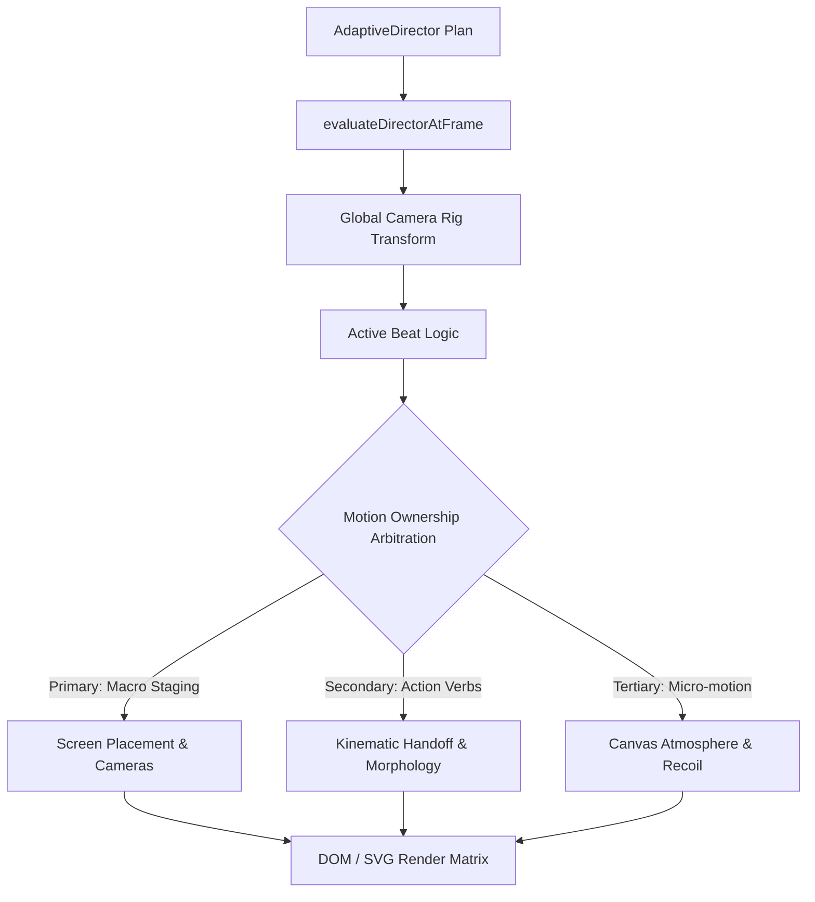

# V25.5 — Production Motion Audit Report

## 1. Executive Summary
This audit traces the actual execution path of the motion graphics pipeline in production (`projects/persian_editorial_motion_test_v19/src/narrative/v24/V24NarrativeSynthesis.tsx`) against the theoretical algorithms established in the V25 experimental motion lab (`src/motion/fidelity/MotionFidelityEngine.ts`).

The visual audit revealed that prior to V25.5, **none of the V25 fidelity algorithms were connected to the production master**. The master pipeline suffered from three core issues:
1. **The Opacity Dissolve Cheat**: Transitions between beats (specifically Beat 01 -> Beat 02) relied on standard opacity cross-fades rather than true kinematic carrier handoffs.
2. **Transform Stacking Conflicts**: Global camera rigs, local element transforms, and background breathing oscillations mutated the transform stack concurrently without an authoritative arbitration hierarchy.
3. **The Smoothness Fallacy**: Applying continuous Bézier or spring damping indiscriminately erased typographic impact, turning sharp kinetic slams into sluggish, mushy drifts.

---

## 2. Execution Path Analysis

### Trace Findings:
- **Transform Overlap**: In V24, `scale` was applied at the Camera Rig level (`scale(${cameraScale})`), at the Beat level, and inside individual element styles (`scale(${scaleX}, ${scaleY})`). Small rounding differences during simultaneous camera zooms caused visible subpixel shimmer.
- **Dead Pause at Seams**: At frame 120 (transition from Beat 01 datum line to Beat 02 slingshot seed), the datum line simply faded out between frames 115-135 while Beat 02 started at frame 120 from a static coordinate `(960, 540)` before pulling back. There was no physical momentum transfer.

---

## 3. Discovered Bottlenecks & Remedies

| Pipeline Component | V24 Baseline Issue | V25.5 Integrated Solution |
| :--- | :--- | :--- |
| **Beat 01 -> 02 Seam** | Opacity dissolve (`interpolate(frame, [115, 125], [0, 1])`) with coordinate reset | **Migration A**: Continuous $C^1$ velocity handoff via `calculateVelocityHandoff`, preserving vector momentum across the boundary with zero opacity fade. |
| **Beat 03 -> 04 Morph** | Discrete SVG layers unmounted and remounted; abrupt geometric jump | **Migration B**: 32-point arc-length equidistant resampling and cyclic shift alignment via `interpolateOptimalMorph`. |
| **Beat 06 Type Slam** | Decoupled Y-translation and independent scale easing; floaty impact | **Migration C**: Unified kinematic impact calculus (`EXPLOSIVE` curve) with coordinated air-stretch, instant ground squash, and hard settle-lock. |

---

## 4. Conclusion
By auditing the actual production path and removing disconnected experimental abstractions, V25.5 replaces procedural tricks with genuine kinematic continuity.
