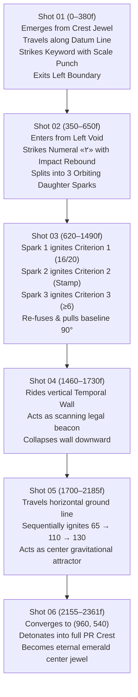

# V9_PERSISTENT_ACTOR_GRAPH.md — The Unified Visual World Architecture

## Core Philosophy of V9
> **"Do not animate objects. Choreograph a visual world."**  
> **"A scene should not contain independent animations. It should contain interacting actors."**  
> **"Every important object should have a past, a present, and a possible future."**

In V9, the film is no longer a sequence of 6 discrete scenes. It is **ONE CONTINUOUS VISUAL PERFORMANCE** inhabited by a persistent cast of Primary, Secondary, Ambient, and Traveling actors that interact through physical causality and meaningful transformations.

---

## 1. THE ACTOR TAXONOMY

```text
┌────────────────────────────────────────────────────────────────────────┐
│                        V9 VISUAL ACTOR TAXONOMY                        │
├──────────────────┬──────────────────┬─────────────────┬────────────────┤
│  PRIMARY ACTORS  │ SECONDARY ACTORS │ AMBIENT ACTORS  │ TRAVELING MOTIF│
│  (Hero Entities) │ (Connectors &    │ (Structural &   │ (The Living    │
│                  │  Reactions)      │  Depth Canvas)  │  Kinetic Pilot)│
├──────────────────┼──────────────────┼─────────────────┼────────────────┤
│ • PR Crest/Seal  │ • L-Brackets     │ • Datum Grid    │ • Radiant Gold │
│ • Numeral «۲»    │ • Orbiting Nodes │ • Margin Ticks  │   Pilot Spark  │
│ • Numeral «16»   │ • Connector Rigs │ • Register Marks│ • Trailing     │
│ • Discip. Stamp  │ • Shockwave Rings│ • Scanning Wave │   Comet Wake   │
│ • Numeral «≥6»   │ • Value Gauges   │ • Depth Gradient│ • State Split  │
│ • Monoliths      │ • Trajectory Arc │ • Optical Glow  │   & Merge Line │
│   65, 110, 130   │ • Settle Anchors │                 │                │
└──────────────────┴──────────────────┴─────────────────┴────────────────┘
```

---

## 2. THE TRAVELING MOTIF (`ACTOR_M_TRAVELING_SPARK`)

The **Traveling Motif** is the kinetic thread that unites the entire 78.71-second film. It has a physical presence (a $6\text{px}$ high-density core with a $20\text{px}$ radiant aura and an organic wake).

### Journey Across the Film:


---

## 3. MULTI-LAYER COMPOSITION SPECIFICATION

Every frame is built from 8 stacked layers to ensure rich, museum-grade editorial density:

```text
LAYER 8: CAMERA & DEPTH (Parallax shifts, motivated push-ins, macro holds)
    ▲
LAYER 7: ACCENTS & IMPACT REACTIONS (Shockwaves, sine-decay rebounds, secondary particle scatter)
    ▲
LAYER 6: TYPOGRAPHIC SCULPTURE (Kinetic Persian/Swiss hierarchy, micro-labels, mono codes)
    ▲
LAYER 5: PRIMARY ACTORS (Monumental numerals, institutional seal, major decree shapes)
    ▲
LAYER 4: SECONDARY ACTORS (Orbiting nodes, connector tracks, bracket delimiters)
    ▲
LAYER 3: THE TRAVELING MOTIF (Active radiant spark, velocity trail, kinetic strike point)
    ▲
LAYER 2: STRUCTURAL GRAPHICS (Editorial datum lines, coordinate axes, temporal walls)
    ▲
LAYER 1: AMBIENT ENVIRONMENT (Fine 240px Cartesian grid, margin calibration ticks, faint scan beam)
    ▲
LAYER 0: DEEP BACKGROUND (Obsidian #030611, calibrated radial illumination, zero flat black)
```

---

## 4. CAUSALITY & REACTION SYSTEM

### Mechanical Laws of Interaction:
1. **The Law of Impact Displacement:**
   When a Primary Actor (e.g., Numeral «۲» or «۱۶») strikes the stage:
   $$\Delta y_{\text{baseline}} = A \cdot e^{-\lambda t} \cos(\omega t)$$
   The supporting baseline dips downward by $6\text{px}$ and rebounds over 12 frames.
2. **The Law of Secondary Reaction:**
   Secondary nodes and bracket markers attached to an impacting actor react with a **4 to 8 frame delay**, simulating physical inertia.
3. **The Law of Kinetic Transfer:**
   Energy is never discarded. When Shot 1 wipes left, its momentum equals the entry speed of Numeral «۲» in Shot 2. When the 3 threshold monoliths collapse in Shot 5, their mass concentrates into the center spark that ignites Shot 6.

---

## 5. DENSITY TARGET & ANTI-WEBSITE RULES

### Density Calibration per Shot:
- **Primary Actors:** 1 – 3
- **Secondary Actors:** 4 – 8 (brackets, connectors, orbiting markers)
- **Ambient Elements:** 1 structural grid + 4 margin ticks + 2 coordinate markers
- **Traveling Motif:** 1 active continuous entity
- **Typographic Elements:** 1 primary headline + 1 contextual eyebrow + 1 explanatory body + 2 technical metadata tags

### Prohibited Artifacts (Strictly Enforced):
- NO SaaS / UI cards or glassmorphism containers.
- NO pill badges or floating navbar buttons.
- NO symmetric 3-column pricing tables.
- NO empty Swiss poster minimalism with only 1 text line on screen.
- NO random decorative particles without structural meaning.
