# SYSTEM ARCHITECTURE: CINEMATIC MOTION-GRAPHICS AGENT

**System:** `cinematic-motion-director`  
**Platform:** Google Antigravity + Gemini  
**Architecture Version:** 1.0.0  

---

## 1. Architectural Philosophy

```text
PROMPT / INPUT (5 Modes)
        ↓
CREATIVE DIRECTOR (Creative Brief & Visual Style Lock)
        ↓
RESEARCH & FACTUAL GROUNDING (Medical/Science Source Ledger)
        ↓
STORY ARCHITECT (Narrative Arc & Beat Breakdown)
        ↓
NARRATION DIRECTOR (Spoken Prose & Spacing Rules)
        ↓
VOICE & TIMING ENGINE (Audio Truth, Word Boundaries, Frame Map)
        ↓
CANONICAL BEAT SHEET (production/beat-sheet.yaml)
        ↓
STORYBOARD & CINEMATOGRAPHY (production/storyboard.yaml)
        ↓
PILOT GATE (First 10–30s Build → Render → Inspect → Approve)
        ↓
PARALLEL SHOT BUILD (Shared Theme & Design Tokens)
        ↓
TWO-TIER QC (Automated Quantitative CV + Visual Inspection)
        ↓
FINAL RENDER & DELIVERY (Packaging, Manifest, Attributions)
```

**Guiding Axiom:**  
*Do not reinvent video infrastructure.* Reuse official Remotion primitives, proven TTS/timing pipelines, and production-tested motion patterns. Build the missing **AI Creative Direction & Production Orchestration Layer** around them.

---

## 2. Division of Responsibility: Reused, Adapted, and Custom

```mermaid
flowchart TD
    subgraph Reused [Reused Infrastructure]
        R1[Remotion Official Skills: CLI, Studio, Render, Markup, Captions]
        R2[anything2explainer: tts_build.py, motion_check.py, frame_metrics.py, selfcheck.py]
        R3[claude-remotion-skill: motion-patterns.md components, design-rules.md]
        R4[video-shotcraft: aesthetic-rules.md R1-R4, Q1-Q10, sound-design.md]
        R5[video-talkcraft: cinematography.md 7-layer model, transition recipes]
    end

    subgraph Adapted [Adapted Modules]
        A1[Beat Sheet Schema: JSON/YAML Canonical Contract]
        A2[Unified CameraRig: Subtle scale 1.00 to 1.05 + 2.5D Parallax]
        A3[Theme Engine: Multi-style presets beyond fixed dark purple]
        A4[Hand-off State Machine: Live demoteAt with semantic token passing]
        A5[Quantitative + Frame Extraction QC Runner]
    end

    subgraph Custom [Custom Antigravity / Gemini Innovations]
        C1[5 Distinct Input Modes Routing: Topic, Script, VO, Script+VO, Docs]
        C2[Creative Director & Style Lock Engine with Strict Checkpoints]
        C3[Medical/Scientific Factual Grounding & Source Traceability Ledger]
        C4[Pilot Production Gate: Enforced 10-30s inspect-before-full-build]
        C5[Multi-Agent Parallel Shot Orchestrator with Locked Token Sharing]
        C6[Dual-Clock Audio-Driven Semantic Time Mapping]
    end

    Reused --> Adapted
    Adapted --> Custom
```



### 2.1 Reused Components (Direct Integration)
* **Official Remotion Toolkit:** `npx remotion studio`, `npx remotion render --concurrency=N --crf 16`, `@remotion/captions`, `@remotion/paths`.
* **Timing & Synthesis Engine:** `tts_build.py` providing dual-clock sentence and word-level alignment, chunk padding, and cache hashing.
* **Automated CV QC Scripts:** `motion_check.py` (hold time ≥30f, static duration ≤3s) and `frame_metrics.py` (hero bounding box ≥170px, soft glow tracking).
* **React Primitives:** `Entrance`, `Staggered`, `WordReveal`, `BgMesh`, `Grade`, `Grain`, `Vignette`, `KenBurns`, `AnimatedCounter`, `LightSweep`, `StageLine`, `HaloRing`, `HeroGlow`, `BigNumber`, `TiltPlane`.

### 2.2 Adapted Components (Refactored for Modularity)
* **Design Token Engine (`src/theme.ts`):** Extracted from hardcoded values into a centralized configuration containing typography, palette (60/30/10), easing bezier curves, spring stiffness/damping, and safe margins.
* **Camera Rig (`src/camera/CameraRig.tsx`):** Unifies `anything2explainer` coordinate transforms with `video-talkcraft` continuous subtle scale push/pull (1.00 -> 1.04–1.06) to eliminate the static stage feeling.
* **Motion Hand-Off (`src/motion/LifeCycle.tsx`):** Implements `forming -> resolved -> handing-off -> gone` with `demoteAt` lowering brightness by 66%, reducing scale to 0.92, and blurring by 3px when the next hero takes the stage.

### 2.3 Custom Capabilities (Built Specifically for Google Antigravity + Gemini)
* **Input Mode Orchestrator:** Dynamic routing across 5 distinct operational modes.
* **Medical / Scientific Mode:** Strict verification rules, non-speculative scientific visualization, and `research/sources.md` claim ledger.
* **Strict Production Checkpoints:** Autonomous technical decisions with mandatory human checkpoints only at material milestones (Creative Brief, Script/Storyboard, Pilot, Delivery).
* **Pilot Gate Enforcement:** Hard system stop preventing full rendering until the first 10–30s pass technical and visual QC.

---

## 3. The 5 Input Modes

### Mode A: Topic In → Full Production
* **Input:** Topic, duration, audience, tone, platform, style.
* **Pipeline:** Topic → Deep Research → Sources Ledger → Creative Brief → Story Beats → Narration Script → TTS Timing → Storyboard → Pilot → Full Build → QC → Delivery.

### Mode B: Script In → Visual Production
* **Input:** Pre-written script / narration.
* **Rule:** The script is immutable (cannot be rewritten without permission).
* **Pipeline:** Script → Semantic Analysis → Timing Generation → Storyboard → Pilot → Full Build → QC → Delivery.

### Mode C: Voiceover In → Motion Production
* **Input:** Pre-recorded audio file (`.wav` / `.mp3`).
* **Rule:** Voiceover is the **physical source of timing truth**.
* **Pipeline:** Audio → Transcription / Timestamp Extraction → Beat Synchronization → Storyboard → Shot Assembly → Delivery.

### Mode D: Script + Voiceover In → Synchronized Motion
* **Input:** Script text + Audio recording.
* **Rule:** Audio is timing truth; Script is semantic truth. Reconciles discrepancies at the word level.
* **Pipeline:** Script + Audio Alignment → Accurate Phoneme/Word Boundary Mapping → Beat Sheet → Storyboard → Delivery.

### Mode E: Documents / Slides / Lecture In → Grounded Explainer
* **Input:** PDF, PPTX, DOCX, lecture audio, figures.
* **Rule:** Information extraction with 100% provenance tracking.
* **Pipeline:** Document Parsing → Research Grounding → Citation Extraction → Narration Synthesis → Visual Translation → Storyboard → Medical/Scientific QC → Delivery.

---

## 4. Production Artifacts & Schema System

All production state is captured in canonical, human-readable, schema-validated files inside `production/`:

```text
production/
├── creative-brief.yaml       # Project DNA, audience, aspect ratio, style tokens
├── style-lock.yaml           # Visual rules, palette, typography, negative prompts
├── beat-sheet.yaml           # Chronological narrative beats, VO lines, shot descriptions
├── storyboard.yaml           # Detailed shot definitions, camera moves, hero elements, SFX
└── timeline.json             # Frame-accurate timing map (sentences, words, chapters)
```

### Beat Sheet Contract (`production/beat-sheet.yaml`)
```yaml
project:
  title: "Apoptosis Mechanism in Oncology"
  fps: 30
  duration_frames: 2160
  aspect_ratio: "16:9"

beats:
  - id: "B01"
    scene: 1
    label: "The Intrinsic Trigger"
    vo:
      text: "Inside a malignant cell, oncogenic stress reaches a tipping point."
      start_frame: 40
      end_frame: 145
    visual_goal: "Introduce stressed cancer cell with mitochondrial tension"
    hero: "Mitochondrion outer membrane"
    shot_type: "Macro Push In"
    camera: "Push 1.00 -> 1.05 with depth tilt"
    motion: "Outer membrane protein clusters activate and glow"
    text_on_screen: "ONCOGENIC STRESS"
    audio:
      sfx: "low_sub_pulse, membrane_creak"
      music_cue: "tension_build"
    transition: "push-through"
    source: "Hanahan & Weinberg, Cell 2011"
    status: "approved"
```

---

## 5. Visual Hierarchy & Anti-Slideshow Rules

### The 3-Tier Visual Hierarchy
Every frame must respect strict priority:
1. **Hero Element (Tier 1):** The single focal point. Height $\ge 170\text{px}$ or Headline $\ge 96\text{px}$. Only the Hero receives rim glow, particle attraction, or highlight sheen.
2. **Secondary Elements (Tier 2):** Supporting metrics, context labels, process flows, schematic links. Never brighter or larger than the Hero.
3. **Environment (Tier 3):** Background mesh, subtle grid/particles, color temperature grade, procedural film grain. Static or carrying subtle atmospheric movement.

### Anti-Slideshow Architecture
To permanently eliminate the "AI PowerPoint Slideshow" look:
1. **Never a Static Camera:** Every scene has a dedicated `CameraRig` executing a continuous micro-push (`1.00 \to 1.04-1.06`) or micro-pull.
2. **Never Freeze on Landing:** Elements do not die when they finish entering. The camera movement sustains their life; after a $30-45\text{f}$ reading hold, secondary motion continues.
3. **Zero Naked Cuts:** Sequences overlap by $12-16\text{f}$ using purposeful cinematic transitions (Push-Through, Whip-Pan, Overexpose-Flip, Black-Slam, Pullback-Cool, Particle-Weld, or Long-Take World).
4. **Active Hand-Off (`demoteAt`):** When Beat 2 begins, Beat 1's hero smoothly scales down ($0.92$), dims ($-66\%$), and blurs ($3\text{px}$) to yield visual attention without cluttering the screen.

---

## 6. Two-Tier Quality Control (QC) Pipeline

```text
RENDER (MP4 + Frame Sequence)
         ↓
TIER 1: AUTOMATED QUANTITATIVE QC
  - motion_check.py: Still duration ≤ 3.0s? Post-landing hold ≥ 30 frames?
  - frame_metrics.py: Hero height ≥ 170px? Zero screen clutter/debris?
  - selfcheck.py: Shot frame boundaries continuous? Zero glitch whitelist leaks?
         ↓ (Pass / Fail)
TIER 2: VISUAL & FACTUAL INSPECTION
  - Contact sheet review (6-up overview cards)
  - Pre-delivery design checklist (Zero linear easing, safe zones, typography contrast)
  - Factual cross-check (Every on-screen number and term matched to research/sources.md)
  - Audio sync audit (Sound effects precede hits by 2-3 frames, music ducked under VO)
         ↓
FIX & RE-RENDER LOOP (Mandatory before delivery)
```
