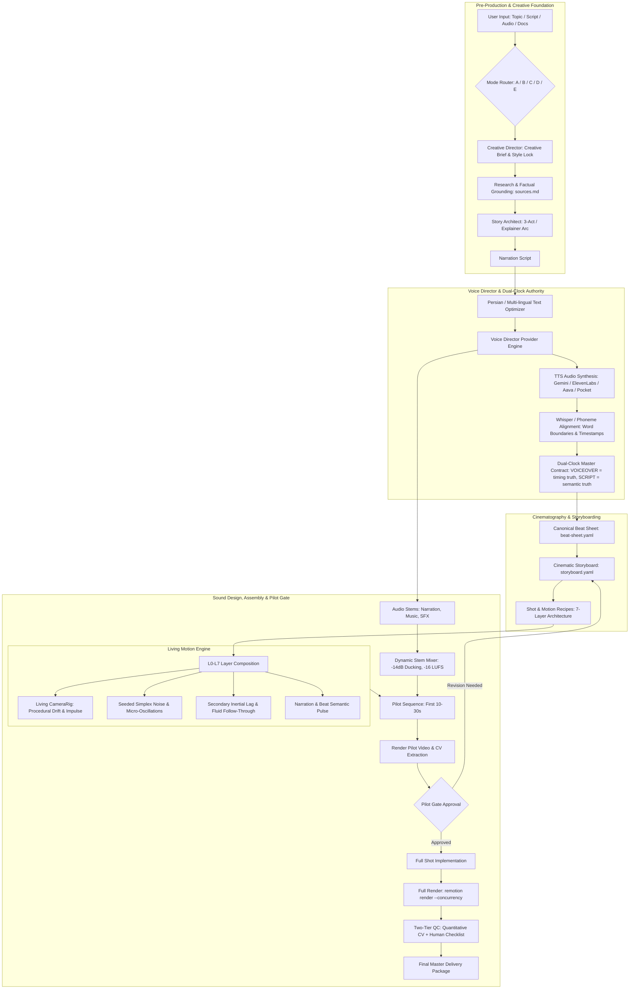

# CINEMATIC MOTION-GRAPHICS AGENT v2: FULL SYSTEM ARCHITECTURE

**System:** `cinematic-motion-director` v2  
**Platform:** Google Antigravity + Gemini 2.5 / Pro  
**Architecture Date:** 2026-10-04  

---

## 1. Core Production Pipeline

---

## 2. The 3 Architectural Pillars of v2

### 2.1 Living Motion Engine
Every frame of video must feel alive, breathing, and physical:
- **Zero Static Freezes:** No element ever rests in absolute stillness. Even in "hold" states, elements exhibit micro-breathing ($1.000 \to 1.012$ scale at $0.2\,\text{Hz}$) or slow gravitational drift ($0.5\,\text{px/sec}$).
- **Procedural Multi-Octave Noise:** Deterministic, frame-indexed Simplex noise ensures organic motion without rendering nondeterminism.
- **Secondary Delayed Physics:** Attached indicators, badges, and labels follow the primary hero with spring-modeled inertial lag (phase delay: 4–8 frames).
- **Audio-Reactive Semantics:** Subtle luminescence and scale expansions trigger on stressed narration syllables and musical beat drops.

### 2.2 Voice Director & Voice-First Pipeline
- **Dual-Clock Authority:** The spoken audio track (`narration.wav`) is the immutable physical clock. Visual cuts and camera moves lock strictly to word boundaries, never arbitrary timer guesses.
- **Stem Architecture:** Narration, cinematic underscore, and sound effects are generated and managed as independent stems before automated ducking and LUFS normalization.

### 2.3 Natural Persian Voice System
- **Rejection of Monotone Engines:** Explicitly avoids default Microsoft/Azure voices in favor of modern prosody-aware models.
- **Orthographic & Phonetic Optimization:** Automated preprocessing handles نیم‌فاصله (ZWNJ), silent ezafe (`-e` / `-ye`), number to Persian words conversion, and English scientific term phonetic substitution.
- **Standardized Benchmark Suite:** Reproducible benchmarking across Gemini Cloud TTS, ElevenLabs, Aava Persian TTS, and Pocket TTS Farsi v2.
