# IMPLEMENTATION PLAN: CINEMATIC MOTION-GRAPHICS AGENT v2

**Document:** `docs/IMPLEMENTATION_PLAN.md`  
**Execution Roadmap:** Phased development and verification of v2  
**Date:** 2026-10-04  

---

## 1. Phased Roadmap Overview

```mermaid
gantt
    title v2 Upgrade Execution Phases
    dateFormat  X
    axisFormat  Day %d
    section Phase 1: Specifications & Audit
    Audit & 7 Design Documents        :done, p1, 0, 1
    User Review & Architectural Gate :active, p2, 1, 2
    section Phase 2: Voice Director & Persian TTS
    VoiceEngine Provider Architecture :p3, 2, 4
    Persian Text Normalizer & Rules   :p4, 3, 5
    Benchmark Suite (audio/voice-benchmark/) :p5, 4, 6
    Stem Mixer & Ducking Engine       :p6, 5, 7
    section Phase 3: Living Motion Engine
    NoiseField & Deterministic Math   :p7, 6, 8
    LivingCameraRig with Drift/Shake  :p8, 7, 9
    OrganicBreathing & SecondaryPhys  :p9, 8, 10
    L0-L7 Composition Refactor        :p10, 9, 11
    section Phase 4: Skill Integration & QC
    Antigravity Skill v2 Update       :p11, 10, 12
    Test Pilot Render & Benchmark Run :p12, 11, 13
    Git Commit & Master Push          :p13, 12, 14
```

---

## 2. Detailed Phase Breakdown

### Phase 1: Audit & Architectural Specification (COMPLETED)
- [x] Comprehensive codebase and dependency audit (`CURRENT_STATE_AUDIT.md`, `DEPENDENCY_AUDIT.md`).
- [x] Clear inventory of reused vs. adapted vs. new components (`REUSE_PLAN.md`).
- [x] Complete system architecture diagram and specification (`ARCHITECTURE.md`).
- [x] Living Motion mathematical and procedural rules (`LIVING_MOTION.md`).
- [x] Voice Director, dual-clock authority, stem mixing, and Persian TTS strategy (`VOICE_ARCHITECTURE.md`).
- [x] Phased implementation roadmap (`IMPLEMENTATION_PLAN.md`).

### Phase 2: Voice Director & Natural Persian Voice Subsystem
- **Step 2.1: Voice Director Core (`audio/engine/`)**
  - Implement abstract `VoiceEngine` base class in Python.
  - Implement adapters: `GeminiVoiceProvider`, `ElevenLabsVoiceProvider`, `AavaVoiceProvider`, `PocketFarsiVoiceProvider`, and `EdgeFallbackVoiceProvider`.
- **Step 2.2: Persian Text Optimizer (`audio/engine/PersianTextOptimizer.py`)**
  - Implement ZWNJ normalizer, ezafe marker, cardinal/ordinal number converter, and transliteration dictionary.
- **Step 2.3: Audio Stem Mixer & Ducking (`audio/mixer/StemMixer.py`)**
  - Implement multi-stem mixing (`narration`, `music`, `sfx`) with automated ducking (-14dB under voice) and ITU-R BS.1770-4 loudness compliance (-16 LUFS).
- **Step 2.4: Persian Voice Benchmark (`audio/voice-benchmark/`)**
  - Create standardized medical/scientific benchmark script testing 5 engines on sample Persian phrases.
  - Generate audio samples and comparison report.

### Phase 3: Living Motion Engine (`src/living-motion/`)
- **Step 3.1: Mathematical Noise Foundation**
  - Create `src/living-motion/NoiseField.ts` providing deterministic, seed-indexed Simplex noise.
- **Step 3.2: Living Camera Rig**
  - Upgrade `src/camera/CameraRig.tsx` into `LivingCameraRig.tsx` featuring continuous push/pull, organic handheld drift, and impulse damping.
- **Step 3.3: Organic Micro-Breathing & Secondary Physics**
  - Implement `OrganicBreathing.tsx` (idle lifecycle breathing).
  - Implement `SecondaryPhysics.tsx` (spring-delayed follower movement).
  - Implement `ParticleDrift.tsx` (ambient Brownian motion particles).
- **Step 3.4: 8-Layer Pipeline Integration**
  - Verify seamless interoperability across L0 through L7 layers.

### Phase 4: Skill Packaging, Pilot Verification & Master Push
- **Step 4.1: Skill Definition Upgrade**
  - Update `.agents/skills/cinematic-motion-director/SKILL.md` and associated references with v2 Living Motion and Voice Director rules.
- **Step 4.2: Pilot Production Test**
  - Execute a test pilot run using the updated engine, verifying audio ducking, Living Motion frame deltas, and Persian narration.
- **Step 4.3: Version Tagging & Remote Push**
  - Commit all changes and push to `HunterHill13/Cinematic-Motion-Graphics-Agent-Skill-Plan`.
